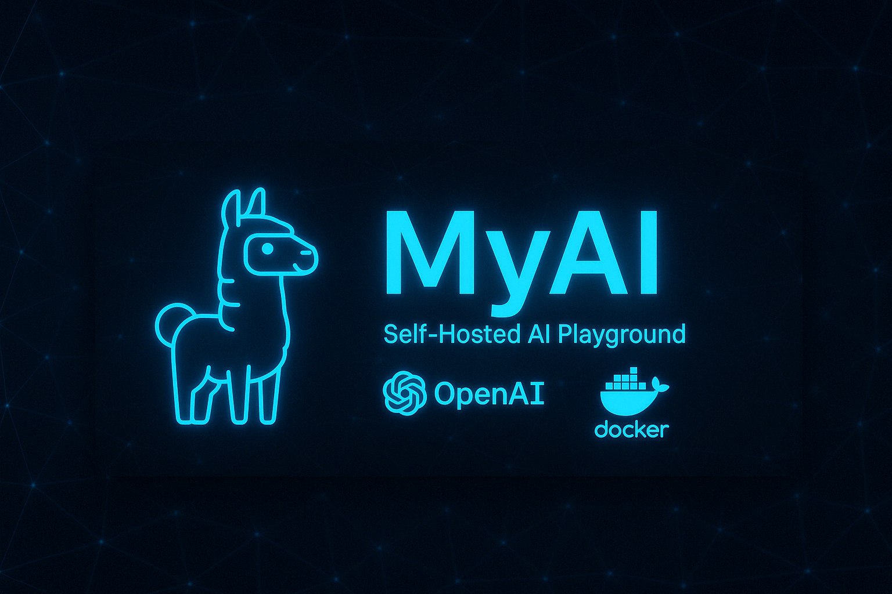

# 🌌 MyAI — A Self-Hosted AI Playground



**MyAI** is a self-hosted development environment for experimenting with modern AI frameworks and large language models (LLMs) locally. It provides a modular, Dockerized setup for integrating and switching between providers like OpenAI, Claude, Ollama, and more — all within your own secure infrastructure.

---
<br><br>

## 🚀 Features

- 🧠 Plug-and-play support for multiple AI providers (OpenAI, Claude, etc.)
- 🐳 Docker-based setup for isolated and reproducible environments
- 🛠️ Easily extendable with custom agents, chains, workflows, and APIs
- 📂 Local-first, privacy-preserving LLM experimentation
- 🧪 Ideal for prompt engineering, agent design, and LLM benchmarking

<br>

## 🧩 Supported Frameworks & Tools

| Provider          | Description                             |
|------------------|-----------------------------------------|
| 🧠 OpenAI         | GPT models via OpenAI APIs              |
| 🤖 Claude         | Anthropic's Claude LLMs                 |
| 🔵 Ollama         | Run local LLMs (e.g., LLaMA, Mistral)   |
| 🐋 Docker         | Containerized environment orchestration |
| 🌐 Open WebUI     | Local LLM UI front-end                  |
| 🧵 LangChain      | Framework for chaining LLM calls        |

---

## 📦 Getting Started

### 1. Clone the Repo

```bash
git clone https://github.com/yourusername/MyAI.git
cd MyAI
```

### 2. Configure Providers
```bash
cp example.env .env
```

### 3. Spin Up Containers
```bash
docker compose --env-file .env up --build
```

### 4. Access the UI

Open your browser to http://localhost:3000 (or your configured port).


<br>

## 🧪 Example Use Cases
- 🔍 Prompt engineering and testing

- 🧠 Building and benchmarking local agents

- 🤖 RAG (retrieval-augmented generation) experiments

- 🛠️ Developer testing of LLM-powered apps
